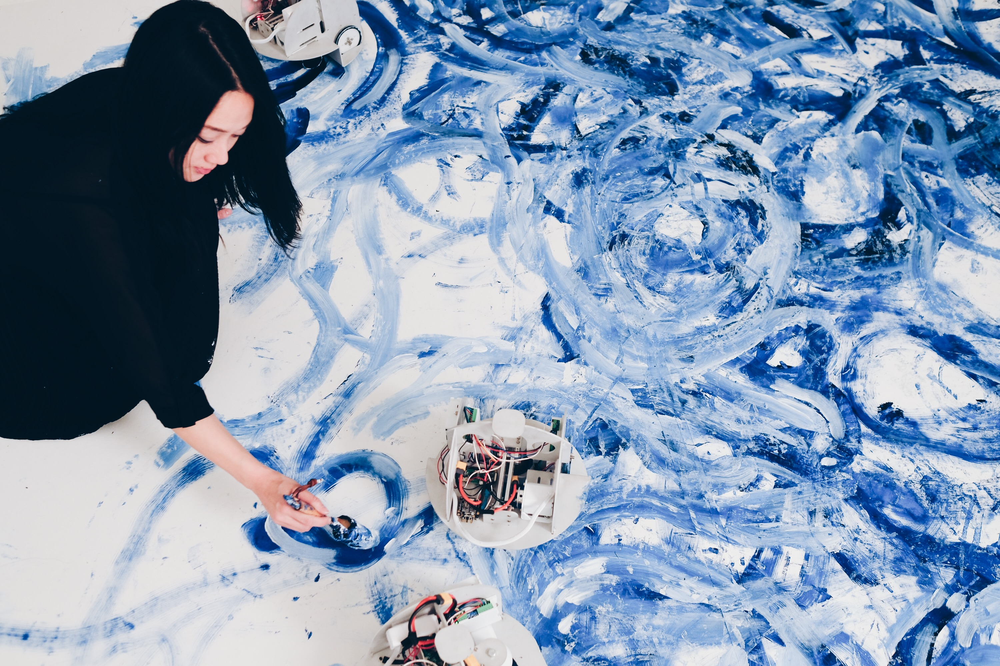
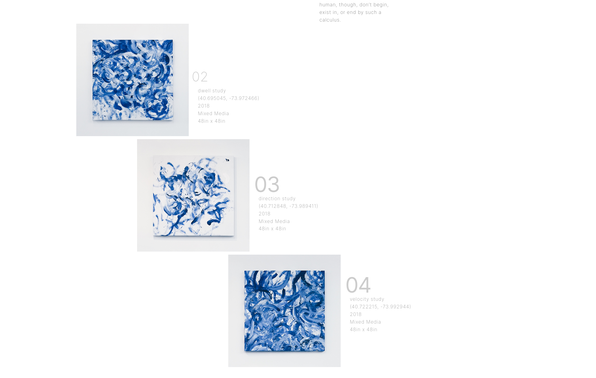

# Omnia per Omnia
## Sougwen Chung

Au délà de la collaboration entre robot et humain, j'ai choisi ce projet pour son thème qui traite des flux de déplacement au sein de New York ; ils sont récupérés à partir de caméra placées dans la ville. Si j'ai bien compris, la caméra capte plus une globalité du mouvement et non chaque individu contrairement à un système de reconnaissance faciale par exemple. Les robots peignent ces flux sur lesquels se calent l'artiste qui peint en collaboration avec ceux-ci, il serait intéressant de trouver une vidéo de performance pour observer comment ils influencent les mouvements de l'artiste et quels sont les flux vidéos qui sont captés. 
Où termine le "je" et où commence le "nous" ?

